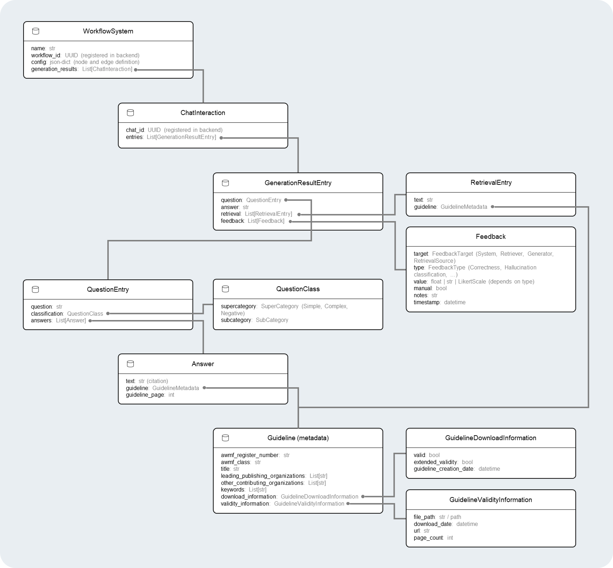
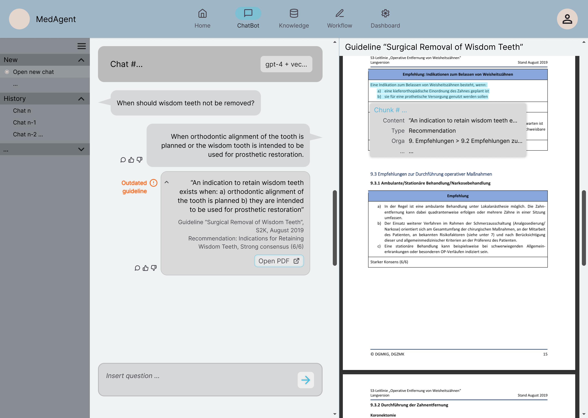

# Notebooks

The purpose of the listed [Jupyter Notebooks](https://jupyter.org/install) is to:

- Rapidly prototype and prepare studies required for the project.
- Suggest and experiment with visualizations for evaluation metrics.
- Interact with data directly (currently via MongoDB), before full backend integration.

Access to the [MongoDB](https://www.mongodb.com/try/download/community) is **currently NOT done via backend calls**.
This will be refactored step by step.

- To prevent conflicts with the main system data, a separate document collection is used: `nb_document_store`
- The data model utilized in this part of the project can be seen in the next subsection

### Data model for MongoDB



## What you'll find in this README

- Overview of current notebooks and their purpose
- Instructions to run notebooks using Docker
- TODOs for transforming notebook logic into frontend/backend components

---

## Contained Notebooks

| Notebook                                                       | Purpose                                                                                                                                                                    | Integrated in Frontend? |
|:---------------------------------------------------------------|:---------------------------------------------------------------------------------------------------------------------------------------------------------------------------|:-----------------------:|
| [`1_guideline.ipynb`](./nbs/1_guideline.ipynb)                 | Tests loading and parsing AWMF guideline structure; includes visual inspection and analysis of document types. Only needs execution once.                                  |            ✗            |
| [`2_question_dataset.ipynb`](./nbs/2_question_dataset.ipynb)   | Interactively inspects and manipulates question classification and guideline linkage, exploring how structured datasets map to document coverage.                          |            ✗            |
| [`3_simple_generation.ipynb`](./nbs/3_simple_generation.ipynb) | Prototypes a basic generate-answer pipeline using the backend generator (e.g., LLM); used to test prompt engineering and model behavior.                                   |            ✗            |
| [`4_naive_rag.ipynb`](./nbs/4_naive_rag.ipynb)                 | Prototypes a basic RAG pipeline with guidelines using the backends vector-based retriever and generator; used to test retrieval quality and enhance in generation quality. |            ✗            |                                                                                                                                

## How to Run

You can run the notebooks inside a Docker container using the provided Conda environment:

0. Ensure the docker compose from the main project is running. We require access to both the MongoDB this starts AND the
   Backend API. Also, assure that you copied the template `.env`, renamed to `.local-env` and fill out the required
   properties to setup the workflows.

1. Build the container:
   ```bash
   cd docker
   docker build -t jupyter-medagent .
   ```

2. Run it
   ```bash
   docker run -d -p 8888:8888  --env-file ../.local-env -v ${PWD}/../:/workspace --name jupyter-medagent-container jupyter-medagent
   ``` 

3. Access notebooks under http://localhost:8888/lab/workspaces/auto-L/tree/nbs/1_guideline.ipynb

## Transform to frontend

As a general note: 
- The backend and frontend require a clear structuring themselves (how to organize different logic components etc.)
- Might be useful to first set that up and then start with integrating the components as described below
- General components that will be integrated into the frontend / backend are:
  - Data (base) access
  - Execution and evaluation logic / functions
  - Presentation of components and evaluation

To structure the transformation, we will look at different features that later need to work in the frontend-backend setup
1. **Guideline Data Management**: Usefully structured entries for Guidelines in MongoDB that can be managed in the UI. Further included should be the setup of a vector database.
2. **System Configuration**: Workflow can already be configured in the backend, but also required is the design of according yaml-configurations via some UI.
3. **System Interaction (chat)**: Again, the backend interaction is already set up, but a UI for selecting an existing system workflow, posing questions and getting the answer and retrieval results displayed is missing.
4. **Evaluation Dashboard**: Combining upload of a question dataset and interaction with it, automatic run of evaluations for a selected system, manual feedback collection for a system, and display of results <small style="color: gray;"> _(with download options)_ </small>.

This covers also the content of all the notebooks, so should ultimately replace them entirely. The next section will provide a detailed plan to allow the components described above.

### (1) Consolidate Data Models and MongoDB Schema
> **Goal**: establish a unified data model and database schema to cover guidelines, questions, answers, systems, chats, evaluations, etc. Enable easy interaction with the MongoDB.

#### Data Models

The data models and organization as it currently is can definitely use some work. The following suggested structure clearly separates:
- Data models purely related to evaluation (can be stored in separate document store for stronger structuring)
- Data models necessary for the overall system to work

First, we will look at the data models important for the overall system:
- `guidelines` storing the pure information on medical guidelines like title, AWMF-id, PDF document, etc.
- `retrieval_sources` storing information on the processed guidelines that are now part of another retrieval source like a vector database. Interesting to store is again the configuration of the database, the type, etc.
- `systems` storing the utilized configured workflow systems, assigned with a unique name <small style="color: gray;"> _(upon setup, need to check whether references external retrieval databases or similar utilized concepts exist)_ </small>. 
- `chat_interaction` being stored for a specific system and user <small style="color: gray;"> _(also stating origin: automatic / human)_ </small>. Contains system outputs and user inputs.
  - User inputs are specified by input text and time.
  - System outputs contain the generated answer (output) <small style="color: gray;"> _(potentially with user feedback: good / bad / nothing + text)_ </small>, potentially retrieved components <small style="color: gray;"> _(per retrieved component, same user feedback described before is possible)_ </small>, response latency, and creation time.

The data models specifically interesting for the evaluation dashboard components are:
- `question_types` storing possible classification of questions with super- and sub-category
- `question_set` storing the questions for an automatic evaluation with a specific name to assign to the same question set with it's classification, the actual question, and the expected retrieval <small style="color: gray;"> _(= sort-of expected answer)_ </small>
- `evaluation` specified for a question dataset, configured workflow system and related created chat interaction created for the evaluation, and for specific generated system outputs also the automatic and manual evaluation. Important: the user feedback is NOT meant here.
  - Maybe introduce a different chat_interaction database and model here, that only exists for the evaluation
  - Idea: only contains one-time interactions, and a different kind of evaluation

> **TODO**: THIS still NEEDS WORK!! Come up with a useful solution to store before implementing
> - To usefully set up the related databases and data models, make sure to think about the model classes
> - This includes: what are important fields? What are the relationships we got? How can entries be uniquely identified?
> 
> Also: include examples for each datatype, to show how it should look like
> - For implementation ideas, see [here](https://testdriven.io/blog/fastapi-mongo/), they set up MongoDB + FastAPI + useful documentation + CRUD interaction
> - Utilize pydantic for schema definition
> - Especially: see how to represent relationships and how it makes sense to store them, to also make individual entities not too large
>   - <small style="color: gray;">_E.g.: workflow system with ALL chat interactions is a bit much, a chat interaction that stores the related system on the other hand not so much_</small>
> 
> Also: how can we store PDFs usefully? How plain text, or structure of the guidelines (user-set chunks)?


#### CRUD handling of MongoDB 

To manage the MongoDB via the backend, also therefore also via the frontend, we first should look at how the backend should be structured (here, just an example, see how backend should be structured):
```text
backend
├─ main.py # entry point, initializes app and routers
├─ routers/ # API router handling HTTP requests
│   ├─ guidelines.py
│   ├─ systems.py
│   ├─ chat.py
│   ├─ evaluation.py
│   └─ ...
├─ models/ # the schemas for the input / output of API + database models (mainly MongoDB)
│   ├─ models/ # contains API models / schemas
│   └─ mongodb/
│       └─ guidelines.py, systems.py, ...
├─ services/ # the logic and interaction with external components like databases, LLMs, ...
│   ├─ mongodb.py # maybe also as folder?
│   └─ ...
└─ utils/ # non-specific helpers like YAML parser, color creation, ...

# Maybe add stuff like system settings / constants? Add typical errors occuring in services?
```

Especially important for smooth interaction with the MongoDB is the service for the MongoDB interaction. Per "database table" it should provide code to interact with it and enable stuff like
- `__init__` to establish a connection
- `find_all` or `get` with some filter specified
- `create`, `update`, `delete` with delete deserving special attention: delete also all related entities?
- `get_schema` to showcase how an entry should / can look like. This should filter out implementation details like `_id` or similar.

The services need to wrap the direct interaction with the MongoDB. Also, write test cases?

With these services set up, the implementation of guideline management endpoints should be quite straightforward. The frontend can then utilize these endpoints and visualize the respective result
- Special attention to PDF handling and also visualization of chunks etc.
- Think of useful filters upfront and make them easy to trigger in the frontend (e.g., get all questions for a specific guideline).

### (2) Implementation of system configuration
> **Goal**: Allow users to create an manage the workflow configuration via a frontend with the help of YAML definitions. 

The endpoints for creation and initialization are already quite ok, although they should be adapted to follow the backend structure suggested above. 
- Also, make sure to store them in the MongoDB as well, with a new schema.
- Alternation not yet possible, make sure to enable this BUT be careful about already created chat interactions (mark that they use an older version of the workflow system) &rarr; or does this even make sense? Only allow alternation of non-used systems?
- And, make sure to enable listing possibilities for configurations
  - E.g., what generators are available? For retrievers, what configuration is possible?

The frontend needs the following integration:
- Overview over all systems
- Posting of new system yaml + feedback visualization (successful, error, ...)
- Help on creating the correct yaml? Or maybe later on

### (3) Implementation of system interaction
> **Goal**: Enable users Q&A conversations with a selected system, including visualization of retrieval components (and later maybe feedback provision) and backend orchestration of workflow execution.

Backend endpoints again should follow structure from above, other than that they are pretty ok already. But to clear up, this should happen during the intended interaction:
1. The user can select from all available systems (or potentially continue with old chat).
2. If a new chat is started: fetch system's config, and initialize the appropriate system (if not already up).
3. User poses a query to chat, the system is executed and returns either some error (nicely wrapped), or the result (generated text, maybe retrieval).
   - Ideally, implement asynchronous
4. Upon continuing interaction, all interactions need to be provided to the system.
5. Presentation of results needs to be nicely integrated, see image below.
6. Interaction needs to be recorded (store upon receiving and before sending).



> **TODO**: Interesting is how to visualize the retrieval. Figure out a way to link a chunk to the PDF origin. Find a way to highlight text / area (chunk) nicely, and maybe even show some metadata about it.
> - Also: How can retrieval be returned without being too large in payload? Maybe return chunk id or similar?

### (4) Evaluation pipeline and dashboard implementation
> **Goal**: Enable user to upload a question dataset, execute some existing system on it, store the evaluation (automatic and manual), and finally also visualize the results.

First, come up with useful structure to store all results. Then create backend endpoints as described above. Different pages are required for:
- Uploading / managing a named question dataset
- Executing the system on questions (can be filtered by dataset and further useful filter like type)
  - Maybe also re-running? Maybe re-running for certain questions only?
  - Maybe asynchronous? But constantly be able to fetch current status?
  - Simultaneously run automatic evaluation? Or separate?
- Gathering manual evaluation on execution
  - Introduce some nice filter here as well: skip all question with existing feedback, concentrate on question types, ...
- Visualizing existing evaluations

This requires some MongoDB classes, like
- `question_dataset`
- `execution` (specified by related questions filter, selected system, also execution time)
- `results` (linked to some execution, storing all generation results AND the evaluation scores)
  - Evaluation scores can be pre-defined, as we apply a limited and fixed set of metrics to all evaluations.

About the frontend integration not much can be said. Take inspiration from the jupyter notebooks. For the visualization, provide some nice way of also displaying results of multiple runs at the same time for a nice comparison.
- Plotly as the main visualizer should be fine
